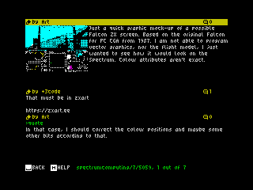

# ZX Spectrum Browser





## Public TNFS

You can [configure your spectranet](http://photo.alioth.net/spectranet-getting-started.pdf) to boot at:
```
zx.desertkun.in
```

* Type `%fsconfig` in BASIC
* Press `A` to set a file system.
* Type `0` for the first file system
* Type `zx.desertkun.in`
* Type `C` to enable autoboot.
* Type `D` to save and exit. Reboot.

## Emulation

| Emulator | How To Enable           |
|------------|-------------------------|
| [Es.pectrum](https://www.habisoft.com/espectrum/EN.htm#Descargas) (Windows)  | Select, Options->Hardware, check "Spectranet", do steps described above |
| [Fuse Emulator](http://fuse-emulator.sourceforge.net/)   | Peripherials->Spectranet, open snapshot (see Releases), NMI->Configure network->Change IP & Gateway, do steps described above |

## Required hardware
Because speccy does not support any internet connectivity by default, with physical device 
you'll need [Spectranet Cartridge](https://www.bytedelight.com/?page_id=3515). 
It may be pricey and hard to get, but please support the manufacturer as it's a very Niche product.

## Installation
Install [docker image](https://hub.docker.com/r/desertkun/channels-hub) of the Hub proxy like so:
```bash
docker run -d --tmpfs /channels/hub/bin/cache -p 9493:9493 -p 16384:16384/udp -it desertkun/channels-hub:latest
```
The proxy will double up as TNFS server so you can simply 
configure your client (`%fsconfig`) to connect to computer that hosts the Hub.

Make sure ports `9493` (tcp) and `16384` (udp) are accessible to the client.

Alternatively, you can build the proxy yourself from [the sources](https://github.com/the-channels/channels/tree/master/hub).

## Source code

You can see the source code on [GitHub](https://github.com/the-channels/channels).
